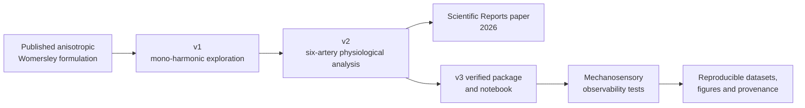

<div align="center">

# **picoNewton**

## Anisotropic Womersley flow, endothelial-scale Lamb forcing, and mechanosensory observability

**Published computational artifacts and a reproducible research extension for studying transverse inertial structure in pulsatile arterial flow.**

[](https://doi.org/10.1038/s41598-026-47474-x)
[](picoNewton_v3/pyproject.toml)
[](#published-computational-artifacts)
[](picoNewton_v3/)
[](picoNewton_v3/tests/)
[](https://creativecommons.org/licenses/by-nc-nd/4.0/)

[**Read the published paper**](https://doi.org/10.1038/s41598-026-47474-x)
&nbsp;&nbsp;·&nbsp;&nbsp;
[**Open v1**](picoNewton_v1.ipynb)
&nbsp;&nbsp;·&nbsp;&nbsp;
[**Open v2**](picoNewton_v2.ipynb)
&nbsp;&nbsp;·&nbsp;&nbsp;
[**Explore v3**](picoNewton_v3/)
&nbsp;&nbsp;·&nbsp;&nbsp;
[**Read the v3 scientific manual**](picoNewton_v3/README.md)

</div>

---

> [!IMPORTANT]
> This repository contains two related but distinct scientific layers:
>
> 1. **Published-paper artifacts** — the original `v1` and `v2` notebooks and companion Python source used to develop and report the anisotropic Womersley study.
> 2. **`picoNewton_v3` research extension** — a tested package and notebook that preserves the published inputs while adding explicit numerical verification, mechanosensory models, physiological coverage, controls, effect gates, and publication-data export.

> [!CAUTION]
> The endothelial-scale Lamb-force quantity is a control-volume integral of a modeled volumetric inertial field. It is not automatically identical to wall traction, membrane tension, or net radial convective acceleration. `picoNewton_v3` documents these distinctions explicitly and keeps mechanosensory coupling as a testable constitutive hypothesis.

## Contents

- [Project overview](#project-overview)
- [Scientific progression](#scientific-progression)
- [Published computational artifacts](#published-computational-artifacts)
- [Theoretical core](#theoretical-core)
- [Mechanics interpretation](#mechanics-interpretation)
- [picoNewton v3 extension](#piconewton-v3-extension)
- [Repository structure](#repository-structure)
- [Reproducing the published work](#reproducing-the-published-work)
- [Running picoNewton v3](#running-piconewton-v3)
- [Validation and provenance](#validation-and-provenance)
- [Citation](#citation)
- [License and contact](#license-and-contact)

---

## Project overview

`picoNewton` investigates how weak anisotropy in the effective viscosity tensor modifies pulsatile arterial flow and generates a transverse velocity-vorticity coupling within the near-wall region.

The published study introduced an anisotropic extension of the classical Womersley problem and evaluated the radial component of the Lamb vector,

$ \boldsymbol{\ell} = \mathbf{u}\times\boldsymbol{\omega}, \qquad \boldsymbol{\omega}=\nabla\times\mathbf{u}, $

inside an endothelial-scale control volume. The resulting force proxy was found to lie on the picoNewton scale for the modeled arterial conditions.

The repository now supports the complete scientific progression:



### Central research questions

| Research layer | Question |
|---|---|
| Anisotropic hydrodynamics | How does tensorial viscosity couple axial and azimuthal pulsatile motion? |
| Near-wall inertial structure | What radial Lamb-vector signal is produced by the reconstructed velocity and vorticity fields? |
| Endothelial-scale integration | What control-volume force scale results near the arterial wall? |
| Mechanosensory extension | Can the Lamb-force waveform produce a sensor response distinguishable from wall shear stress? |
| Reproducibility | Which conclusions survive numerical verification, physiological coverage, controls, and held-out model comparison? |

---

## Scientific progression

### Stage I — exploratory anisotropic Womersley solver

The first implementation maps the coupled hydrodynamic phase space and studies how the Womersley number and anisotropy ratios affect:

- axial and azimuthal velocity;
- axial and azimuthal vorticity;
- near-wall gradients;
- transverse Lamb-vector magnitude;
- endothelial-scale force estimates.

### Stage II — physiological multi-harmonic analysis

The second implementation introduces six signed pressure-gradient harmonics for six arterial sites:

1. aortic root;
2. thoracic aorta;
3. femoral artery;
4. carotid artery;
5. iliac artery;
6. brachial artery.

It reconstructs time-dependent fields and evaluates the modeled near-wall force and spectral content under artery-specific conditions.

### Stage III — mechanosensory observability and reproducibility

`picoNewton_v3` extends the project from hydrodynamic force reconstruction to a falsifiable mechanosensory question:

> **Can the endothelial-scale Lamb-force waveform generate force-gated dynamics that cannot be reduced to a rescaled, shifted, or kinetically filtered wall-shear-stress signal?**

The v3 workflow introduces:

- a verified numerical path;
- a separate reproduction path for historical traceability;
- a two-state force-work sensor;
- C0–C13 controls;
- E1–E8 immutable effect gates;
- physiological Sobol coverage;
- held-out WSS-surrogate testing;
- deterministic manifests, checkpoints, checksums, and dataset export.

---

## Published computational artifacts

| Artifact | Role | Scientific scope | Recommended use |
|---|---|---|---|
| [`picoNewton_v1.ipynb`](picoNewton_v1.ipynb) | Original notebook | Foundational solver development and mono-harmonic parameter exploration | Historical reproduction and inspection |
| [`picoNewton_v1.py`](picoNewton_v1.py) | Exported Python companion | Reviewable source corresponding to the early notebook workflow | Source reading and provenance |
| [`picoNewton_v2.ipynb`](picoNewton_v2.ipynb) | Published physiological notebook | Six arteries, six signed harmonics, near-wall force and spectral analyses | Primary published-work artifact |
| [`picoNewton_v3/`](picoNewton_v3/) | Research-software extension | Verified solver, mechanosensor models, controls, uncertainty design, figures and data export | New research and reproducible extension |

### Notebook provenance

The committed `picoNewton_v2.ipynb` blob used by the v3 provenance guard is:

```text
9d61c237cda75df338ce0383038f7765c886f503
```

`picoNewton_v3` checks the expected v2 identity before publication-profile calculations and can execute an output-stripped copy as a cold regression guard.

### Published article

**Khalid M. Saqr.**  
*A transverse picoNewton force revealed in anisotropic Womersley flow.*  
**Scientific Reports** 16, 12584 (2026).  
DOI: [`10.1038/s41598-026-47474-x`](https://doi.org/10.1038/s41598-026-47474-x)

---

## Theoretical core

### Axisymmetric fully developed velocity field

The modeled velocity field is

$ \mathbf{u}(r,t) = u_\theta(r,t)\,\mathbf{e}_\theta + u_z(r,t)\,\mathbf{e}_z, \qquad u_r=0. $

The harmonic velocity amplitudes satisfy the nondimensional anisotropic Womersley system

$ i h\alpha^2 U_z^{(h)} = a_h + \mathcal{L}_0 U_z^{(h)} + \beta\,\mathcal{L}_1 U_\theta^{(h)}, $

$ i h\alpha^2 U_\theta^{(h)} = \gamma\,\mathcal{L}_0 U_z^{(h)} + \delta\,\mathcal{L}_1 U_\theta^{(h)}, $

where

$ \mathcal{L}_0 = \frac{d^2}{dr^{*2}} + \frac{1}{r^*}\frac{d}{dr^*}, $

$ \mathcal{L}_1 = \frac{d^2}{dr^{*2}} + \frac{1}{r^*}\frac{d}{dr^*} - \frac{1}{r^{*2}}, $

and

$ \alpha = R\sqrt{\frac{\omega_0}{\nu_{zz}}}, \qquad \beta=\frac{\nu_{z\theta}}{\nu_{zz}}, \qquad \gamma=\frac{\nu_{\theta z}}{\nu_{zz}}, \qquad \delta=\frac{\nu_{\theta\theta}}{\nu_{zz}}. $

The isotropic limit is

$ \beta=0, \qquad \gamma=0, \qquad \delta=1. $

### Boundary conditions

At the centerline,

$ \left.\frac{dU_z^{(h)}}{dr^*}\right|_{r^*=0}=0, \qquad U_\theta^{(h)}(0)=0. $

At the arterial wall,

$ U_z^{(h)}(1)=0, \qquad U_\theta^{(h)}(1)=0. $

### Vorticity and radial Lamb vector

For the present velocity field,

$ \omega_\theta = -\frac{\partial u_z}{\partial r}, $

$ \omega_z = \frac{1}{r}\frac{\partial(ru_\theta)}{\partial r}. $

The radial Lamb-vector component is

$ \ell_r = u_\theta\omega_z-u_z\omega_\theta. $

Because this quantity is nonlinear, the verified v3 workflow reconstructs the real physical fields before multiplication:

$ u_j(r,t) = \Re\left[ \sum_{h=1}^{H} U_j^{(h)}(r)e^{ih\omega_0t} \right]. $

### Endothelial-scale control-volume quantity

The modeled signed force is

$ F_L(t) = \int_{V_{\mathrm{EC}}} \rho\,\ell_r(\mathbf{x},t)\,dV. $

Under the thin near-wall pillbox approximation,

$ F_L(t) \approx A_{\mathrm{EC}} \int_{R-\delta_{\mathrm{EC}}}^{R} \rho\,\ell_r(r,t)\,dr, $

with

$ \delta_{\mathrm{EC}} = \frac{V_{\mathrm{EC}}}{A_{\mathrm{EC}}}. $

The published baseline geometry uses

$ A_{\mathrm{EC}}=100\times10^{-12}\ \mathrm{m^2}, \qquad V_{\mathrm{EC}}=10^{-15}\ \mathrm{m^3}. $

---

## Mechanics interpretation

The Gromeka–Lamb identity is

$ (\mathbf{u}\cdot\nabla)\mathbf{u} = \nabla\left(\frac{|\mathbf{u}|^2}{2}\right) - \mathbf{u}\times\boldsymbol{\omega}. $

For

$ \mathbf{u} = (0,u_\theta,u_z), $

the radial convective acceleration is

$ \left[(\mathbf{u}\cdot\nabla)\mathbf{u}\right]_r = -\frac{u_\theta^2}{r}. $

Meanwhile,

$ \ell_r = u_z\frac{\partial u_z}{\partial r} + u_\theta\frac{\partial u_\theta}{\partial r} + \frac{u_\theta^2}{r}. $

Therefore, the Lamb-vector term and the radial kinetic-energy gradient must be interpreted together when reconstructing the complete convective acceleration.

### Distinct physical quantities

| Quantity | Definition | Units | Interpretation |
|---|---|---:|---|
| Lamb vector | $\boldsymbol{\ell}=\mathbf{u}\times\boldsymbol{\omega}$ | $\mathrm{m\,s^{-2}}$ | Local velocity-vorticity inertial field |
| Volumetric force density | $\rho\boldsymbol{\ell}$ | $\mathrm{N\,m^{-3}}$ | Density-scaled modeled inertial field |
| Control-volume force | $\int_V\rho\boldsymbol{\ell}\,dV$ | N | Integrated force proxy over a defined volume |
| Cauchy traction | $\mathbf{t}=\boldsymbol{\sigma}\mathbf{n}$ | Pa | Actual surface traction on a boundary |
| Radial convective acceleration | $-u_\theta^2/r$ | $\mathrm{m\,s^{-2}}$ | Net radial component of $(\mathbf{u}\cdot\nabla)\mathbf{u}$ |

> [!NOTE]
> The repository preserves the published Lamb-force formulation while `picoNewton_v3` makes the interpretation boundary explicit. Mechanosensory coupling is modeled through a generalized work coordinate and is not presented as an experimentally identified receptor mechanism.

---

## picoNewton v3 extension

The v3 package is located in [`picoNewton_v3/`](picoNewton_v3/).

### Primary entry points

| Entry point | Purpose |
|---|---|
| [`picoNewton_v3/README.md`](picoNewton_v3/README.md) | Complete scientific and user manual |
| [`picoNewton_v3/notebooks/picoNewton_v3_mechanosensory.ipynb`](picoNewton_v3/notebooks/picoNewton_v3_mechanosensory.ipynb) | Main notebook and Colab workflow |
| [`picoNewton_v3/run_workflow.py`](picoNewton_v3/run_workflow.py) | Command-line execution |
| [`picoNewton_v3/src/piconewton_v3/`](picoNewton_v3/src/piconewton_v3/) | Tested Python modules |
| [`picoNewton_v3/configs/`](picoNewton_v3/configs/) | Quick/publication profiles and immutable gates |
| [`picoNewton_v3/data/`](picoNewton_v3/data/) | Curated inputs, units, sources, controls and schemas |
| [`picoNewton_v3/tests/`](picoNewton_v3/tests/) | Numerical, I/O, notebook and workflow tests |

### Mechanosensor model

The minimal force-gated model is

$ C \underset{k_-(\Psi)}{\stackrel{k_+(\Psi)}{\rightleftharpoons}} O, \qquad p(t)=\Pr(O), $

with

$ \frac{dp}{dt} = k_+(\Psi)(1-p)-k_-(\Psi)p. $

The Lamb-force work coordinate is

$ \Psi_L(t) = \frac{d_L}{k_BT}\, \mathcal{G}_L[F_L(t)], $

while the WSS channel uses a distinct conjugate activation volume,

$ \Psi_\tau(t) = \frac{V_\tau}{k_BT}\, \mathcal{G}_\tau[\tau_w(t)]. $

The package supports signed, reversed-direction, magnitude-sensitive, inward-only, and outward-only Lamb-force hypotheses. These are reported as separate model classes.

### v3 scientific safeguards

- `verified` and `reproduction` solver paths remain separate;
- the real fields are reconstructed before nonlinear products in verified mode;
- C0–C13 controls test zero input, WSS-only, Lamb-only, isotropic flow, harmonic truncation, phase scrambling, RMS matching, direction, magnitude, and historical reproduction;
- E1–E8 gates predeclare detectability, WSS nonredundancy, parameter connectivity, directional specificity, harmonic specificity, anisotropy specificity, robustness, and transparent model-class reporting;
- failed gates remove or qualify claims rather than trigger threshold changes.

---

## Repository structure

```text
picoNewton/
├── README.md
├── picoNewton_v1.ipynb
├── picoNewton_v1.py
├── picoNewton_v2.ipynb
└── picoNewton_v3/
    ├── README.md
    ├── CITATION.cff
    ├── configs/
    ├── data/
    ├── docs/
    ├── notebooks/
    ├── references/
    ├── src/piconewton_v3/
    ├── tests/
    ├── pyproject.toml
    ├── requirements.txt
    └── run_workflow.py
```

### Which artifact should I use?

| Goal | Start here |
|---|---|
| Read the published paper | [Scientific Reports article](https://doi.org/10.1038/s41598-026-47474-x) |
| Inspect the original exploratory workflow | [`picoNewton_v1.ipynb`](picoNewton_v1.ipynb) |
| Reproduce the published six-artery notebook | [`picoNewton_v2.ipynb`](picoNewton_v2.ipynb) |
| Read reviewable legacy Python source | [`picoNewton_v1.py`](picoNewton_v1.py) |
| Run a tested quick workflow | [`picoNewton_v3/run_workflow.py`](picoNewton_v3/run_workflow.py) |
| Run in Jupyter or Colab | [`picoNewton_v3_mechanosensory.ipynb`](picoNewton_v3/notebooks/picoNewton_v3_mechanosensory.ipynb) |
| Understand the full v3 formulation | [`picoNewton_v3/README.md`](picoNewton_v3/README.md) |
| Inspect units, sources and data contracts | [`picoNewton_v3/data/`](picoNewton_v3/data/) |
| Inspect verification and tests | [`picoNewton_v3/tests/`](picoNewton_v3/tests/) |

---

## Reproducing the published work

### Google Colab or Jupyter

Open either notebook directly:

- [`picoNewton_v1.ipynb`](picoNewton_v1.ipynb)
- [`picoNewton_v2.ipynb`](picoNewton_v2.ipynb)

Colab links:

- [Open `picoNewton_v1.ipynb` in Colab](https://colab.research.google.com/github/khalid-saqr/picoNewton/blob/main/picoNewton_v1.ipynb)
- [Open `picoNewton_v2.ipynb` in Colab](https://colab.research.google.com/github/khalid-saqr/picoNewton/blob/main/picoNewton_v2.ipynb)

The historical notebooks may install TeX packages for publication typography. A compatible environment requires the standard scientific Python stack and, for exact legacy figure typography, a TeX distribution.

### Legacy typography dependencies

```bash
sudo apt-get update
sudo apt-get install texlive texlive-latex-extra texlive-fonts-recommended dvipng cm-super
```

### Legacy Python stack

```text
numpy
scipy
matplotlib
pandas
tqdm
```

> [!TIP]
> Use the original notebooks when the goal is historical reproduction of the published workflow. Use `picoNewton_v3` when the goal is numerical verification, package-level reuse, mechanosensory analysis, physiological coverage, or archive-ready data generation.

---

## Running picoNewton v3

### Installation

From the repository root:

```bash
python -m pip install -e "./picoNewton_v3[dev]"
pytest picoNewton_v3/tests
```

### Quick command-line execution

```bash
python picoNewton_v3/run_workflow.py \
  --profile quick \
  --storage local
```

### Publication profile

```bash
python picoNewton_v3/run_workflow.py \
  --profile publication \
  --storage local
```

The publication profile uses:

| Setting | Value |
|---|---:|
| Radial Chebyshev order | 150 |
| Time points per cardiac cycle | 2,048 |
| Near-wall quadrature nodes | 256 |
| Physiological Sobol samples | 4,096 |
| Input harmonics | 6 |
| Nonlinear output support | DC through harmonic 12 |
| Sensor initialization | Exact periodic fixed point |

### v3 notebook

- [Open the notebook](picoNewton_v3/notebooks/picoNewton_v3_mechanosensory.ipynb)
- [Open in Colab](https://colab.research.google.com/github/khalid-saqr/picoNewton/blob/main/picoNewton_v3/notebooks/picoNewton_v3_mechanosensory.ipynb)

The notebook supports:

- local storage;
- Google Drive storage in Colab;
- deterministic run identifiers;
- resumable checkpoints;
- HDF5 and CSV outputs;
- figure-source data;
- environment and source manifests;
- SHA-256 checksums;
- archive-ready publication bundles.

---

## Validation and provenance

### Published artifacts

The original notebooks remain unchanged as historical scientific records. Their role is provenance and reproduction of the published analysis.

### v3 verification

The v3 package contains tests for:

- analytical isotropic Womersley agreement;
- Chebyshev differentiation;
- normalized linear-system residuals;
- nonlinear harmonic support;
- near-wall quadrature convergence;
- exact periodic sensor closure;
- probability bounds;
- deterministic I/O;
- notebook structure;
- end-to-end workflow execution.

The validated quick workflow reports **15 passing tests**. Quick-profile results are software diagnostics, not publication-resolution evidence.

### Solver modes

| Mode | Purpose | Claim use |
|---|---|---|
| `reproduction` | Traceability to the current public legacy executable behavior | Regression and comparison only |
| `verified` | Polynomial-tested differentiation and real-field nonlinear evaluation | Required for primary v3 results |

### Data and source provenance

The v3 package records:

- exact configurations;
- Git commit and v2 blob identity;
- physical units;
- input and output checksums;
- source identifiers and licenses;
- random seeds;
- environment metadata;
- complete summary and spectral tables.

See:

- [`picoNewton_v3/data/source_manifest.csv`](picoNewton_v3/data/source_manifest.csv)
- [`picoNewton_v3/data/data_dictionary.csv`](picoNewton_v3/data/data_dictionary.csv)
- [`picoNewton_v3/docs/REPRODUCIBILITY.md`](picoNewton_v3/docs/REPRODUCIBILITY.md)
- [`picoNewton_v3/docs/DATA_AVAILABILITY.md`](picoNewton_v3/docs/DATA_AVAILABILITY.md)
- [`picoNewton_v3/docs/CODE_AVAILABILITY.md`](picoNewton_v3/docs/CODE_AVAILABILITY.md)

---

## Citation

### Published article

```bibtex
@article{Saqr2026PicoNewton,
  author  = {Saqr, Khalid M.},
  title   = {A transverse picoNewton force revealed in anisotropic Womersley flow},
  journal = {Scientific Reports},
  year    = {2026},
  volume  = {16},
  pages   = {12584},
  doi     = {10.1038/s41598-026-47474-x}
}
```

### Software extension

Citation metadata for the v3 package are provided in:

```text
picoNewton_v3/CITATION.cff
```

When using the mechanosensory extension, cite both the published article and the archived software release or commit used for the analysis.

---

## License and contact

This repository declares the **Creative Commons Attribution–NonCommercial–NoDerivatives 4.0 International** license.

[](https://creativecommons.org/licenses/by-nc-nd/4.0/)

**Author:** Khalid M. Saqr<br>
**Contact:** `k[dot]saqr[at]aast[dot]edu`

---

<div align="center">

**Published hydrodynamics · preserved provenance · verified extension · falsifiable mechanosensory hypotheses**

</div>
