<div align="center">

# **picoNewton v3**

## Mechanosensory observability in anisotropic Womersley flow

**A source-traceable computational research package for testing whether the endothelial-scale Lamb-force waveform carries mechanosensory information that is dynamically distinguishable from wall shear stress.**

[](https://doi.org/10.1038/s41598-026-47474-x)
[](pyproject.toml)
[](pyproject.toml)
[](tests/)
[](notebooks/picoNewton_v3_mechanosensory.ipynb)
[](configs/)
[](https://creativecommons.org/licenses/by-nc-nd/4.0/)

[**Open the notebook**](notebooks/picoNewton_v3_mechanosensory.ipynb)
&nbsp;&nbsp;·&nbsp;&nbsp;
[**Run locally**](#quick-start)
&nbsp;&nbsp;·&nbsp;&nbsp;
[**Read the model specification**](docs/MODEL_SPECIFICATION.md)
&nbsp;&nbsp;·&nbsp;&nbsp;
[**Inspect reproducibility controls**](docs/REPRODUCIBILITY.md)

[](https://colab.research.google.com/github/khalid-saqr/picoNewton/blob/main/picoNewton_v3/notebooks/picoNewton_v3_mechanosensory.ipynb)

</div>

---

> [!IMPORTANT]
> **Scientific claim boundary.** `picoNewton v3` evaluates a *constitutive mechanosensory hypothesis*. It does not identify an endothelial receptor, does not equate the Lamb vector with membrane tension, and does not treat the endothelial control-volume Lamb force as exact wall traction or net radial acceleration.

> [!CAUTION]
> The `quick` profile and the archived dry-run results are software and diagnostic results. They are not publication-resolution evidence. Manuscript claims remain conditional on the immutable effect gates being passed by the locked `publication` profile.

## Contents

- [Scientific purpose](#scientific-purpose)
- [What v3 adds](#what-v3-adds)
- [Architecture](#research-workflow-and-architecture)
- [Mathematical model](#mathematical-model)
- [Mechanics interpretation](#mechanics-interpretation)
- [Numerical formulation](#numerical-formulation)
- [Controls and effect gates](#controls-and-effect-gates)
- [Execution profiles](#execution-profiles)
- [Quick start](#quick-start)
- [Notebook and Colab](#notebook-and-colab)
- [Command-line workflow](#command-line-workflow)
- [Programmatic API](#programmatic-api)
- [Google Drive and storage](#google-drive-and-storage)
- [Dataset contract](#publication-dataset-contract)
- [Figures](#publication-figure-set)
- [Verification](#verification-and-quality-assurance)
- [Preliminary gate status](#preliminary-diagnostic-gate-status)
- [Repository structure](#repository-structure)
- [Citation and licence](#citation)

---

## Scientific purpose

The published `picoNewton` model introduced a transverse endothelial-scale force derived from anisotropic Womersley flow. Version 3 asks the next, narrower question:

> **Can the time-dependent endothelial Lamb-force waveform generate a force-gated sensor response that cannot be reduced to a rescaled, shifted, or kinetically filtered wall-shear-stress signal?**

The package is designed around four falsifiable subquestions:

1. **Detectability:** does the Lamb channel generate a non-negligible response over a connected parameter region rather than at an isolated tuned point?
2. **Nonredundancy:** does the response persist against an optimized WSS-only surrogate on held-out arteries and parameter cases?
3. **Directional information:** do inward- and outward-sensitive receptor hypotheses produce distinguishable dynamics?
4. **Specificity:** are any responses specifically attributable to anisotropy or to higher cardiac harmonics?

The workflow reports negative results as first-class outputs. Thresholds are stored in immutable configuration files and are not adjusted after results are observed.

### Scientific contract

| Layer | Implemented statement | Explicit non-claim |
|---|---|---|
| Hydrodynamics | Preserves the six-artery anisotropic Womersley formulation and signed harmonic inputs from `picoNewton_v2.ipynb` | Does not silently revise v2 inputs |
| Lamb field | Evaluates $\boldsymbol{\ell}=\mathbf{u}\times\boldsymbol{\omega}$ after reconstructing real fields in `verified` mode | Does not equate $\boldsymbol{\ell}$ with total material acceleration |
| Endothelial load | Integrates $\rho\ell_r$ through a near-wall endothelial control volume | Does not identify this quantity as exact wall traction |
| Mechanosensor | Uses a dimensionally closed two-state force-work model | Does not identify Piezo1, TRPV4, FAK, or another specific receptor |
| Physiology | Samples declared adult resting coverage envelopes and preserves exact v2 baselines | Does not interpret coverage fractions as patient probabilities |
| Publication logic | Uses predeclared numerical and effect-size gates | Does not promote a failed diagnostic gate into a manuscript claim |

---

## What v3 adds

`picoNewton_v3/` is a self-contained research-software package rather than a single monolithic notebook.

| Capability | v3 implementation |
|---|---|
| Verified hydrodynamic path | Polynomial-tested Chebyshev differentiation and real-field nonlinear multiplication |
| Reproduction path | Traceability to the current public executable ordering and differentiation layout |
| Mechanosensor | Local-detailed-balance two-state kinetics with exact periodic initialization |
| Comparators | WSS-only, Lamb-only, parallel channels, anisotropy excess, spectral controls, directional controls, and a held-out optimized WSS surrogate |
| Physiological design | Six preserved arteries, structured parameter grids, and deterministic Sobol coverage |
| Reproducibility | v2 blob guard, output stripping, optional cold execution, deterministic run IDs, manifests, environment snapshots, and SHA-256 checksums |
| Storage | Atomic local/Google Drive I/O with resumable physiological checkpoints |
| Publication outputs | HDF5 signals, tidy CSV tables, spectra, eight figures, source-data tables, and availability statements |
| Claim selection | Machine-readable E1–E8 acceptance gates with automatic claim retention or removal |

The expected frozen Git blob for `picoNewton_v2.ipynb` is:

```text
9d61c237cda75df338ce0383038f7765c886f503
```

---

## Research workflow and architecture

```mermaid
flowchart LR
    A[Exact v2 artery inputs<br/>and six harmonics] --> B[v2 hash and provenance guard]
    B --> C{Solver mode}
    C -->|verified| D[Polynomial-tested<br/>Chebyshev solver]
    C -->|reproduction| E[Public executable<br/>regression path]
    D --> F[Reconstruct real<br/>velocity and vorticity]
    E --> G[Retain legacy harmonic<br/>product ordering]
    F --> H[Radial Lamb field<br/>and anisotropic WSS]
    G --> H
    H --> I[Endothelial force integration]
    I --> J[Two-state mechanosensor]
    H --> K[WSS comparator channel]
    J --> L[C0-C13 control engine]
    K --> L
    L --> M[Structured grid and Sobol coverage]
    M --> N[Held-out WSS surrogate]
    N --> O[E1-E8 immutable gates]
    O --> P[Figures, HDF5, CSV,<br/>manifests and checksums]
```



The notebook orchestrates this graph; the scientific implementation resides in tested modules under [`src/piconewton_v3/`](src/piconewton_v3/).

---

## Mathematical model

### 1. Kinematics and harmonic representation

The fully developed, axisymmetric velocity field is

$$
\mathbf{u}(r,t)=u_\theta(r,t)\,\mathbf{e}_\theta+u_z(r,t)\,\mathbf{e}_z,
\qquad u_r=0.
$$

For harmonic index $h$, the complex velocity amplitudes are denoted by $U_z^{(h)}(r^*)$ and $U_\theta^{(h)}(r^*)$, where

$$
r^*=\frac{r}{R}.
$$

The Womersley number is

$$
\alpha=R\sqrt{\frac{\omega_0}{\nu_{zz}}}.
$$

The radial operators are

$$
\mathcal{L}_0
=\frac{d^2}{dr^{*2}}+\frac{1}{r^*}\frac{d}{dr^*},
$$

$$
\mathcal{L}_1
=\frac{d^2}{dr^{*2}}+\frac{1}{r^*}\frac{d}{dr^*}-\frac{1}{r^{*2}}.
$$

The nondimensional anisotropic harmonic system is

$$
i h\alpha^2 U_z^{(h)}
=a_h+\mathcal{L}_0 U_z^{(h)}+\beta\mathcal{L}_1 U_\theta^{(h)},
$$

$$
i h\alpha^2 U_\theta^{(h)}
=\gamma\mathcal{L}_0 U_z^{(h)}+\delta\mathcal{L}_1 U_\theta^{(h)}.
$$

The anisotropy ratios are

$$
\beta=\frac{\nu_{z\theta}}{\nu_{zz}},
\qquad
\gamma=\frac{\nu_{\theta z}}{\nu_{zz}},
\qquad
\delta=\frac{\nu_{\theta\theta}}{\nu_{zz}}.
$$

The isotropic limit is

$$
\beta=0,
\qquad
\gamma=0,
\qquad
\delta=1.
$$

Boundary conditions are imposed as

$$
\left.\frac{dU_z^{(h)}}{dr^*}\right|_{r^*=0}=0,
\qquad
U_\theta^{(h)}(0)=0,
$$

$$
U_z^{(h)}(1)=0,
\qquad
U_\theta^{(h)}(1)=0.
$$

The physical fields are reconstructed from the retained harmonics before nonlinear multiplication in `verified` mode:

$$
u_z(r,t)=\Re\left[\sum_{h=1}^{H}U_z^{(h)}(r)e^{ih\omega_0 t}\right],
$$

$$
u_\theta(r,t)=\Re\left[\sum_{h=1}^{H}U_\theta^{(h)}(r)e^{ih\omega_0 t}\right].
$$

### 2. Vorticity and Lamb vector

For the present velocity field,

$$
\omega_\theta=-\frac{\partial u_z}{\partial r},
$$

$$
\omega_z=\frac{1}{r}\frac{\partial(ru_\theta)}{\partial r}.
$$

The Lamb vector is

$$
\boldsymbol{\ell}=\mathbf{u}\times\boldsymbol{\omega},
$$

with radial component

$$
\ell_r=u_\theta\omega_z-u_z\omega_\theta.
$$

The corresponding inertial force density is

$$
\mathbf{f}_L=\rho\boldsymbol{\ell},
$$

with SI units

$$
[\boldsymbol{\ell}]=\mathrm{m\,s^{-2}},
\qquad
[\rho\boldsymbol{\ell}]=\mathrm{N\,m^{-3}}.
$$

### 3. Endothelial control-volume force

The endothelial thickness proxy is

$$
\delta_{\mathrm{EC}}=\frac{V_{\mathrm{EC}}}{A_{\mathrm{EC}}}.
$$

The signed radial Lamb-force waveform is

$$
F_L(t)
=A_{\mathrm{EC}}
\int_{R-\delta_{\mathrm{EC}}}^{R}
\rho\ell_r(r,t)\,dr.
$$

The nonnegative exposure measure is

$$
F_{L,\mathrm{exposure}}(t)
=A_{\mathrm{EC}}
\int_{R-\delta_{\mathrm{EC}}}^{R}
\left|\rho\ell_r(r,t)\right|\,dr.
$$

The signed and exposure quantities are stored and analyzed separately.

### 4. Anisotropic wall shear stress

The inherited anisotropic axial traction at the wall is

$$
\tau_{zr}(t)
=\frac{\mu U_0}{R}
\Re\left[
\sum_{h=1}^{H}
\left(
\left.\frac{dU_z^{(h)}}{dr^*}\right|_{1}
+\beta
\left[
\left.\frac{dU_\theta^{(h)}}{dr^*}\right|_{1}
-U_\theta^{(h)}(1)
\right]
\right)
 e^{ih\omega_0t}
\right].
$$

Because the no-slip condition gives $U_\theta^{(h)}(1)=0$, the implementation retains the full constitutive expression rather than deleting the term symbolically.

### 5. Two-state mechanosensor

The minimal sensor is

$$
C
\underset{k_-(\Psi)}{\stackrel{k_+(\Psi)}{\rightleftharpoons}}
O,
\qquad
p(t)=\Pr(O).
$$

The active/open-state probability satisfies

$$
\frac{dp}{dt}
=k_+(\Psi)(1-p)-k_-(\Psi)p.
$$

The local-detailed-balance rates are

$$
k_+(\Psi)
=\frac{p_0}{\tau_0}\exp(\theta\Psi),
$$

$$
k_-(\Psi)
=\frac{1-p_0}{\tau_0}\exp[-(1-\theta)\Psi].
$$

Therefore,

$$
\frac{k_+}{k_-}
=\frac{p_0}{1-p_0}e^\Psi,
$$

and the constant-input equilibrium is

$$
p_\infty(\Psi)
=\operatorname{logistic}\left[
\operatorname{logit}(p_0)+\Psi
\right].
$$

The force channel enters through molecular work:

$$
\Psi_L(t)=\frac{d_L}{k_BT}\,\mathcal{G}_L[F_L(t)].
$$

The WSS channel uses a distinct work conjugate:

$$
\Psi_\tau(t)=\frac{V_\tau}{k_BT}\,\mathcal{G}_\tau[\tau_w(t)].
$$

The minimal independent parallel-channel hypothesis is

$$
\Psi_{\mathrm{parallel}}(t)=\Psi_L(t)+\Psi_\tau(t).
$$

#### Force-receptor hypotheses

| Mode | Mapping $\mathcal{G}_L(F)$ | Interpretation |
|---|---:|---|
| `signed` | $\sigma_LF$ | Direction-sensitive receptor hypothesis |
| `magnitude` | $|F|$ | Direction-insensitive exposure hypothesis |
| `outward_only` | $\max(F,0)$ | Rectified outward activation |
| `inward_only` | $\max(-F,0)$ | Rectified inward activation |

These are separate model classes. Their outputs are never averaged into one biological probability.

### 6. Governing dimensionless groups

The principal mechanosensory groups are

$$
\Lambda_L=\frac{F_{L,\mathrm{ref}}d_L}{k_BT},
$$

$$
\Lambda_\tau=\frac{\tau_{w,\mathrm{ref}}V_\tau}{k_BT},
$$

$$
\Omega=\omega_0\tau_0,
$$

$$
\eta_0=\log\left(\frac{p_0}{1-p_0}\right).
$$

At $T=310.15\ \mathrm{K}$,

$$
k_BT\approx4.2821\ \mathrm{pN\,nm}.
$$

---

## Mechanics interpretation

The Gromeka–Lamb identity is

$$
(\mathbf{u}\cdot\nabla)\mathbf{u}
=\nabla\left(\frac{|\mathbf{u}|^2}{2}\right)
-\mathbf{u}\times\boldsymbol{\omega}.
$$

For

$$
\mathbf{u}=(0,u_\theta,u_z),
$$

the actual radial convective acceleration is

$$
[(\mathbf{u}\cdot\nabla)\mathbf{u}]_r
=-\frac{u_\theta^2}{r}.
$$

Meanwhile,

$$
\ell_r
=u_z\frac{\partial u_z}{\partial r}
+u_\theta\frac{\partial u_\theta}{\partial r}
+\frac{u_\theta^2}{r}.
$$

Thus the kinetic-energy-gradient and Lamb terms must be interpreted together when discussing net acceleration. In isotropic Womersley flow, $u_\theta=0$ and the actual radial convective acceleration is zero even though $u_z\partial_ru_z$ appears in the Lamb field.

> [!NOTE]
> `picoNewton v3` therefore treats $F_L$ as a **generalized endothelial mechanosensory input hypothesis**. The package preserves and tests that hypothesis while explicitly separating it from net radial acceleration and from the total Cauchy traction $\mathbf{t}=\boldsymbol{\sigma}\mathbf{n}$.

---

## Numerical formulation

### Chebyshev collocation

The radial problem is discretized with Chebyshev–Gauss–Lobatto nodes. The `verified` differentiation matrix is row-oriented and must differentiate low-order polynomials to machine precision.

The production constitutive sample must also satisfy the positive-dissipation condition

$$
\delta-
\left(\frac{\beta+\gamma}{2}\right)^2>0.
$$

### Real-field nonlinear evaluation

With six input harmonics, the real-field quadratic Lamb product can contain a DC component and frequencies through harmonic 12. The workflow therefore:

- reconstructs real velocity and vorticity before multiplication in `verified` mode;
- records the DC component explicitly;
- evaluates spectral power through $h=12$;
- treats power above $h=12$ as an aliasing diagnostic.

### Exact periodic sensor state

For a piecewise-constant input over one time interval,

$$
p_{i+1}=a_ip_i+b_i.
$$

Composing one cardiac cycle gives

$$
p_{\mathrm{end}}=Ap_{\mathrm{start}}+B.
$$

The exact periodic initial state is therefore

$$
p_{\mathrm{periodic}}=\frac{B}{1-A}.
$$

This removes arbitrary burn-in cycles and provides a direct cycle-closure residual.

### Solver modes

| Mode | Differentiation | Nonlinear ordering | Permitted use |
|---|---|---|---|
| `verified` | Polynomial-tested row-oriented Chebyshev matrix | Reconstruct real fields, then evaluate $\mathbf{u}\times\boldsymbol{\omega}$ | Primary numerical and manuscript results |
| `reproduction` | Current public executable layout | Form harmonic products before reconstruction | Regression traceability only |

No result generated solely in `reproduction` mode can support a primary scientific claim.

---

## Controls and effect gates

### C0–C13 control matrix

| ID | Control | Scientific question |
|---|---|---|
| C0 | Zero input | Does the sensor return its basal state? |
| C1 | WSS only | What response is generated by the conventional shear channel? |
| C2 | Total Lamb only | What response is generated by the standalone force hypothesis? |
| C3 | Parallel WSS + Lamb | Does the additional channel change the combined response? |
| C4 | Anisotropy-excess Lamb | Is the anisotropic increment detectable separately from the isotropic baseline? |
| C5 | Isotropic hydrodynamics | What remains when $\beta=\gamma=0$ and $\delta=1$? |
| C6 | Retain $h\le2$ | Are harmonics $h\ge3$ mechanosensorily important? |
| C7 | Phase-scrambled input | Is the response sensitive to source-harmonic phase organization? |
| C8 | RMS-matched sinusoid | Does waveform complexity matter beyond RMS amplitude? |
| C9 | Amplitude-matched WSS | Is the distinction caused only by uncertain gain? |
| C10 | Best-fit WSS surrogate | Can optimized WSS gain, offset, lag, and kinetics explain the combined response on held-out cases? |
| C11 | Direction reversal | Do inward- and outward-sensitive hypotheses diverge? |
| C12 | Magnitude sensor | What remains when force direction is discarded? |
| C13 | Reproduction solver | Are conclusions robust to the explicit legacy regression path? |

The complete machine-readable definitions are in [`data/controls_matrix.csv`](data/controls_matrix.csv).

### E1–E8 manuscript gates

| Gate | Required evidence | Role |
|---|---|---|
| E1 | Absolute RMS Lamb-channel effect $\ge0.005$, at least $10\times$ numerical uncertainty, with cross-artery and coverage support | Core detectability |
| E2 | Held-out optimized WSS-surrogate residual $\ge0.005$ and $\ge5\%$ of target dynamic range | Nonredundancy |
| E3 | Connected passing region spanning at least one decade in $d_L$ or $\tau_0$ | Excludes isolated tuning |
| E4 | Directional difference $\ge0.005$ RMS or $\ge0.02$ cycle in peak phase | Direction claim |
| E5 | Removing $h\ge3$ changes the response by at least $20\%$ and $0.002$ absolutely | High-harmonic claim |
| E6 | Anisotropy-specific sensor difference $\ge0.002$ and $\ge10\times$ numerical uncertainty | Anisotropy claim |
| E7 | Robust effect direction across the declared coverage range | Robustness claim |
| E8 | Signed, magnitude, inward-only, and outward-only models remain separately reported | Transparency requirement |

Exact thresholds are stored in:

- [`configs/effect_gates.json`](configs/effect_gates.json)
- [`data/effect_size_acceptance_criteria.csv`](data/effect_size_acceptance_criteria.csv)

> [!IMPORTANT]
> A failed specificity gate removes the corresponding claim; it does not automatically invalidate every broader analysis. Conversely, a broader positive result does not authorize a high-harmonic, anisotropy-specific, or receptor-specific claim.

---

## Execution profiles

| Profile | Radial order | Time points/cycle | Near-wall nodes | Sobol samples | v2 cold execution | Intended use |
|---|---:|---:|---:|---:|---|---|
| `quick` | 70 | 256 | 64 | 64 | No | End-to-end smoke test, schema validation, and development |
| `publication` | 150 | 2048 | 256 | 4096 | Yes | Full numerical verification, controls, figures, and archive-ready dataset |

Configuration files are immutable run inputs:

```text
configs/quick.json
configs/publication.json
configs/numerical_thresholds.json
configs/effect_gates.json
```

---

## Quick start

### Requirements

- Python 3.10 or newer
- NumPy 1.26 or newer
- SciPy 1.11 or newer
- pandas 2.0 or newer
- Matplotlib 3.8 or newer
- HDF5 support through `h5py`
- Jupyter execution support through `nbformat` and `nbclient`

### Clone and install

```bash
git clone https://github.com/khalid-saqr/picoNewton.git
cd picoNewton
python -m pip install -e "./picoNewton_v3[dev]"
```

### Run the automated tests

```bash
pytest picoNewton_v3/tests
```

Expected package-level result for the current release:

```text
15 passed
```

### Run the quick workflow

```bash
python picoNewton_v3/run_workflow.py \
  --profile quick \
  --storage local
```

To write results to a selected local path:

```bash
python picoNewton_v3/run_workflow.py \
  --profile quick \
  --root ./picoNewton_v3_outputs
```

### Run the publication workflow

```bash
python picoNewton_v3/run_workflow.py \
  --profile publication \
  --storage local
```

The publication workflow must run from the complete parent `picoNewton` repository because it verifies and cold-executes the frozen `picoNewton_v2.ipynb` source.

---

## Notebook and Colab

The primary research notebook is:

```text
notebooks/picoNewton_v3_mechanosensory.ipynb
```

It is intentionally an orchestration document. Numerical implementation resides in importable, tested modules rather than hidden notebook state.

The notebook executes the following sequence:

1. resolve the repository and output roots;
2. load the immutable profile;
3. create a deterministic run ID;
4. verify the frozen v2 blob;
5. strip v2 outputs and optionally cold-execute it;
6. validate the isotropic analytical limit;
7. compute six-artery anisotropic hydrodynamics;
8. execute C0–C13 controls;
9. run the sensor grid and physiological Sobol coverage;
10. fit and test the held-out WSS surrogate;
11. evaluate E1–E8;
12. generate eight figures;
13. export the complete dataset and checksums;
14. select or remove manuscript claims from the gate table.

### Notebook environment variables

| Variable | Default | Purpose |
|---|---|---|
| `PICONEWTON_PROFILE` | `quick` | Select `quick` or `publication` |
| `PICONEWTON_REF` | `main` | Git ref cloned automatically in Colab |
| `PICONEWTON_STORAGE` | profile setting | Override `auto`, `drive`, or `local` storage |
| `PICONEWTON_V3_ROOT` | unset | Override the complete output root |
| `PICONEWTON_DEV_SKIP_V2_HASH` | `0` | Development-only isolated quick-run escape hatch |

> [!WARNING]
> `PICONEWTON_DEV_SKIP_V2_HASH=1` is a development convenience only. It is prohibited for publication-profile results.

---

## Command-line workflow

```text
usage: run_workflow.py [-h]
                       [--profile {quick,publication}]
                       [--storage {auto,drive,local}]
                       [--root ROOT]
                       [--skip-v2-hash]
```

| Argument | Meaning |
|---|---|
| `--profile` | Select numerical and sampling resolution |
| `--storage` | Choose automatic, Google Drive, or local storage |
| `--root` | Override the local output directory |
| `--skip-v2-hash` | Development-only isolated quick run; rejected as publication provenance |

---

## Programmatic API

The public package exports immutable model inputs, the hydrodynamic solver, mechanosensor functions, and validation helpers.

```python
import numpy as np

from piconewton_v3 import (
    FluidProperties,
    HydrodynamicConfig,
    SensorConfig,
    V2_ARTERY_CASES,
    compute_hydrodynamics,
    lamb_work,
    periodic_sensor_solution,
)

case = V2_ARTERY_CASES[0]
fluid = FluidProperties()
hydro_config = HydrodynamicConfig(
    radial_order=70,
    time_points=256,
    quadrature_nodes=64,
    beta=0.1,
    gamma=0.1,
    delta=1.0,
    mode="verified",
)

hydro = compute_hydrodynamics(case, hydro_config, fluid)

psi_lamb = lamb_work(
    hydro["force_signed_n"],
    coupling_length_m=1e-9,
    temperature_k=310.15,
    mode="signed",
)

probability, closure_residual = periodic_sensor_solution(
    psi_lamb,
    frequency_hz=fluid.fundamental_frequency_hz,
    sensor=SensorConfig(),
)

print(case.name)
print("force RMS [pN] =", np.sqrt(np.mean(hydro["force_signed_n"] ** 2)) * 1e12)
print("periodic residual =", closure_residual)
```

The complete API implementation is organized by scientific responsibility:

| Module | Responsibility |
|---|---|
| [`types.py`](src/piconewton_v3/types.py) | Immutable model inputs and preserved v2 cases |
| [`hydrodynamics.py`](src/piconewton_v3/hydrodynamics.py) | Chebyshev solver, validation, real-field Lamb force, and anisotropic WSS |
| [`sensor.py`](src/piconewton_v3/sensor.py) | Work mappings, rates, equilibrium, and exact periodic sensor solution |
| [`controls.py`](src/piconewton_v3/controls.py) | C0–C13 controls and held-out WSS surrogate |
| [`design.py`](src/piconewton_v3/design.py) | Parameter grids, Sobol designs, and physiological coverage |
| [`gates.py`](src/piconewton_v3/gates.py) | E1–E8 machine-readable decisions |
| [`verification.py`](src/piconewton_v3/verification.py) | Runtime numerical verification dashboard |
| [`study_io.py`](src/piconewton_v3/study_io.py) | Atomic storage, manifests, HDF5, resume, and checksums |
| [`figures_export.py`](src/piconewton_v3/figures_export.py) | Publication figures and dataset export |
| [`provenance.py`](src/piconewton_v3/provenance.py) | Environment snapshots, Git hashes, and v2 regression guards |

---

## Google Drive and storage

Storage mode `auto` behaves as follows:

- inside Colab: mount Google Drive and use the configured Drive directory;
- outside Colab: use the configured local directory;
- when `PICONEWTON_V3_ROOT` or `--root` is supplied: use the explicit local path.

The storage layer provides:

- deterministic run identifiers derived from configuration and code state;
- atomic writes through temporary files and `os.replace`;
- resumable physiological checkpoints;
- path-traversal rejection;
- per-file SHA-256 records;
- run status transitions: `initialized`, `running`, `complete`, or `failed`;
- HDF5 groups for artery-resolved signals;
- publication-bundle assembly.

Google Drive is an execution and checkpoint backend. It is **not** the final publication archive. The final dataset must be exported and deposited in a versioned public repository with a DOI.

---

## Publication dataset contract

Each deterministic run has the form

```text
runs/<run_id>/
├── checkpoints/
│   └── physiological_coverage/
├── fields/
│   └── hydrodynamic_signals.h5
├── figures/
│   ├── Figure1_force_waveforms.pdf
│   ├── Figure1_force_waveforms.png
│   └── ...
├── logs/
├── provenance/
│   ├── environment.json
│   ├── v2_hash_guard.json
│   ├── v2_stripping.json
│   └── checksums.sha256
├── publication_bundle/
├── spectra/
│   └── physiological_force_spectra.csv
├── summaries/
│   ├── control_results.csv
│   ├── effect_gates.csv
│   ├── nominal_waveforms.csv
│   ├── parameter_dominance.csv
│   ├── parameter_grid.csv
│   ├── physiological_coverage.csv
│   ├── physiological_design.csv
│   ├── runtime_verification.csv
│   ├── sobol_sensor_design.csv
│   └── wss_surrogate.csv
└── run_manifest.json
```

### Primary stored quantities

| Quantity | Symbol | Unit |
|---|---:|---:|
| Axial velocity | $u_z$ | $\mathrm{m\,s^{-1}}$ |
| Azimuthal velocity | $u_\theta$ | $\mathrm{m\,s^{-1}}$ |
| Axial vorticity | $\omega_z$ | $\mathrm{s^{-1}}$ |
| Azimuthal vorticity | $\omega_\theta$ | $\mathrm{s^{-1}}$ |
| Radial Lamb component | $\ell_r$ | $\mathrm{m\,s^{-2}}$ |
| Radial force density | $\rho\ell_r$ | $\mathrm{N\,m^{-3}}$ |
| Signed endothelial force | $F_L$ | $\mathrm{N}$ |
| Exposure force | $F_{L,\mathrm{exposure}}$ | $\mathrm{N}$ |
| Wall shear stress | $\tau_w$ | $\mathrm{Pa}$ |
| Sensor probability | $p$ | dimensionless |

The complete schema and data dictionary are available in:

- [`data/publication_dataset_schema.json`](data/publication_dataset_schema.json)
- [`data/data_dictionary.csv`](data/data_dictionary.csv)
- [`data/source_manifest.csv`](data/source_manifest.csv)

---

## Publication figure set

The workflow creates every figure directly from exported source tables in both PDF and 300-DPI PNG formats.

| Figure | File | Scientific role |
|---:|---|---|
| 1 | `Figure1_force_waveforms` | Signed Lamb-force waveforms for all six arteries |
| 2 | `Figure2_sensor_channels` | WSS-only, Lamb-only, and parallel sensor channels |
| 3 | `Figure3_observability_map` | Median response difference over $(d_L,\tau_0)$ |
| 4 | `Figure4_control_matrix` | Nominal C0–C13 control summary |
| 5 | `Figure5_wss_surrogate` | Held-out optimized WSS-surrogate residuals |
| 6 | `Figure6_effect_gates` | Machine-readable E1–E8 pass/fail matrix |
| 7 | `Figure7_specificity_effects` | High-harmonic and anisotropy-specific effects |
| 8 | `Figure8_parameter_dominance` | Spearman parameter-dominance map |

Rendered figures are outputs, not manually edited evidence. Figure source data and checksums are retained with every completed run.

---

## Verification and quality assurance

### Automated tests

The current package test suite covers:

- Chebyshev polynomial differentiation;
- isotropic analytical Womersley validation;
- positive constitutive dissipation;
- probability-state bounds;
- exact periodic sensor closure;
- deterministic run identifiers;
- atomic storage and checksum registration;
- path-safety rules;
- notebook structure and code-cell compilation;
- all six arteries and all control identifiers;
- physiological design reproducibility;
- effect-gate output structure.

Run:

```bash
pytest picoNewton_v3/tests
```

### Quick-profile verification record

The clean end-to-end quick notebook completed with the following representative guards:

| Test | Observed result |
|---|---:|
| Isotropic analytical error | $1.31\times10^{-14}$ |
| Polynomial differentiation error | $2.54\times10^{-13}$ |
| Maximum normalized backward residual | $4.96\times10^{-17}$ |
| Periodic sensor closure | $1.11\times10^{-16}$ |
| Power above nonlinear harmonic 12 | $1.72\times10^{-31}$ |
| Force time-resolution error | $1.70\times10^{-16}$ |
| Near-wall quadrature error | $1.60\times10^{-6}$ |

The publication profile re-evaluates all numerical guards at the locked production resolution. It does not inherit a passing decision merely because the quick profile passed.

---

## Preliminary diagnostic gate status

The reduced dry and quick implementations currently indicate:

| Gate | Diagnostic status | Current interpretation |
|---|---|---|
| E1 — cross-artery detectability | **FAIL** | Detectable regions exist, but the fixed artery/coverage criterion is not met |
| E2 — WSS nonredundancy | **FAIL** | Held-out optimized WSS residuals remain below the fixed absolute threshold |
| E3 — contiguous support | **PASS** | Passing regions are connected and span at least one decade |
| E4 — directional specificity | **PASS** | Inward- and outward-sensitive hypotheses are materially different |
| E5 — high-harmonic specificity | **FAIL** | The fixed cross-artery specificity criterion is not met |
| E6 — anisotropy-specific detectability | **FAIL** | The anisotropic increment is not broadly detectable under the fixed gate |
| E7 — full-range robustness | **FAIL** | The lower-tail effect is not sufficiently robust across coverage |
| E8 — model-class transparency | **PASS** | Signed and rectified receptor classes remain separate |

These outcomes are deliberately reported rather than optimized away. Final scientific conclusions must be generated from the publication profile and the unchanged gate definitions.

---

## Physiological coverage and provenance

The primary analysis preserves six exact v2 arterial cases:

| Artery | Baseline radius | Pressure-gradient scale |
|---|---:|---:|
| Aortic root | 15 mm | 9000 Pa/m |
| Thoracic aorta | 12 mm | 7000 Pa/m |
| Femoral | 4 mm | 6000 Pa/m |
| Carotid | 3.5 mm | 6500 Pa/m |
| Iliac | 4.5 mm | 5500 Pa/m |
| Brachial | 2 mm | 4000 Pa/m |

The broader ranges are computational coverage envelopes, not population confidence intervals. Therefore, a statement such as “the gate passed in 60% of coverage samples” must not be rewritten as “60% of patients are expected to respond.”

External waveform and geometry resources are optional validation adapters. Large third-party archives are referenced by stable identifiers and checksums rather than redistributed. See [`data/source_manifest.csv`](data/source_manifest.csv) for source roles, access conditions, and licences.

---

## Repository structure

```text
picoNewton_v3/
├── configs/                  immutable profiles, thresholds, and effect gates
├── data/                     curated inputs, units, ranges, and provenance tables
├── docs/                     model, reproducibility, and availability documents
├── notebooks/                clean publication notebook
├── references/               BibTeX bibliography
├── src/piconewton_v3/
│   ├── controls.py           C0-C13 and WSS surrogate
│   ├── design.py             grids, Sobol, and physiological coverage
│   ├── figures_export.py     figures and dataset export
│   ├── gates.py              E1-E8 decisions
│   ├── hydrodynamics.py      verified/reproduction Womersley solver
│   ├── model.py              public compatibility exports
│   ├── provenance.py         hashes, environment, and v2 regression
│   ├── sensor.py             force-work kinetics
│   ├── study_io.py           local/Drive storage and checksums
│   ├── types.py              immutable model inputs
│   ├── verification.py       runtime numerical dashboard
│   └── workflow.py           workflow public exports
├── tests/                    numerical, I/O, workflow, and notebook tests
├── CITATION.cff
├── pyproject.toml
├── requirements.txt
└── run_workflow.py
```

### Documentation map

| Document | Purpose |
|---|---|
| [`docs/MODEL_SPECIFICATION.md`](docs/MODEL_SPECIFICATION.md) | Formal equations, assumptions, and claim boundaries |
| [`docs/REPRODUCIBILITY.md`](docs/REPRODUCIBILITY.md) | Reproduction protocol, hashes, profiles, and run records |
| [`docs/QUICK_EXECUTION_REPORT.md`](docs/QUICK_EXECUTION_REPORT.md) | Verified quick-profile execution record |
| [`docs/PRELIMINARY_DRY_RUN.md`](docs/PRELIMINARY_DRY_RUN.md) | Diagnostic scientific gate outcomes |
| [`docs/DATA_AVAILABILITY.md`](docs/DATA_AVAILABILITY.md) | Draft journal Data Availability statement |
| [`docs/CODE_AVAILABILITY.md`](docs/CODE_AVAILABILITY.md) | Draft journal Code Availability statement |

---

## Reproducibility checklist

A result is publication-eligible only when all applicable items are satisfied:

- [ ] the complete parent repository is used;
- [ ] the v2 blob SHA matches the frozen value;
- [ ] the output-stripped v2 notebook cold-executes successfully;
- [ ] `solver_mode` is `verified` for the primary analysis;
- [ ] analytical and runtime numerical guards pass;
- [ ] the exact immutable configuration is archived;
- [ ] the Git commit is recorded;
- [ ] the environment snapshot is recorded;
- [ ] physiological checkpoints complete without missing samples;
- [ ] every output file is registered with SHA-256;
- [ ] E1–E8 are evaluated without threshold modification;
- [ ] failed gates remove or qualify the corresponding claims;
- [ ] figure source data are included;
- [ ] the final dataset is deposited in a DOI-backed public archive.

---

## Citation

Use [`CITATION.cff`](CITATION.cff) for software citation metadata.

### Primary scientific article

```bibtex
@article{Saqr2026Transverse,
  author  = {Saqr, Khalid M.},
  title   = {A transverse picoNewton force revealed in anisotropic Womersley flow},
  journal = {Scientific Reports},
  year    = {2026},
  volume  = {16},
  pages   = {12584},
  doi     = {10.1038/s41598-026-47474-x}
}
```

### Mechanosensor energetics reference

```bibtex
@article{WigginsPhillips2004,
  author  = {Wiggins, Paul and Phillips, Rob},
  title   = {Analytic models for mechanotransduction: gating a mechanosensitive channel},
  journal = {Proceedings of the National Academy of Sciences},
  year    = {2004},
  volume  = {101},
  number  = {12},
  pages   = {4071--4076},
  doi     = {10.1073/pnas.0307804101}
}
```

The complete bibliography is maintained in [`references/references.bib`](references/references.bib).

### Recommended acknowledgement

When using this package, report:

- the repository commit;
- the profile and complete configuration hash;
- the solver mode;
- the v2 blob SHA;
- the output run ID;
- the numerical verification table;
- the effect-gate table;
- the public dataset DOI.

---

## Licence

The repository declares **CC BY-NC-ND 4.0**. Third-party articles, software, and datasets retain their original licences and redistribution conditions. Consult [`data/source_manifest.csv`](data/source_manifest.csv) before redistributing external material.

---

<div align="center">

**picoNewton v3 is designed to make a difficult scientific hypothesis easier to falsify, reproduce, audit, and refine.**

</div>
